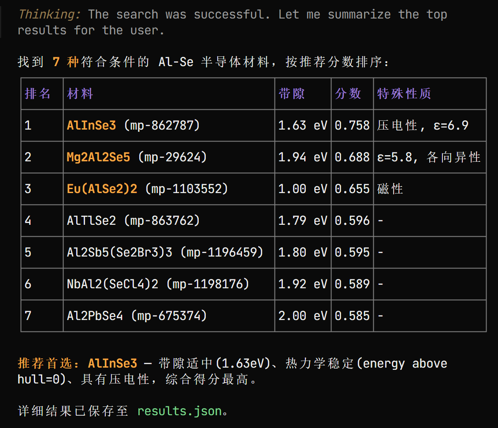
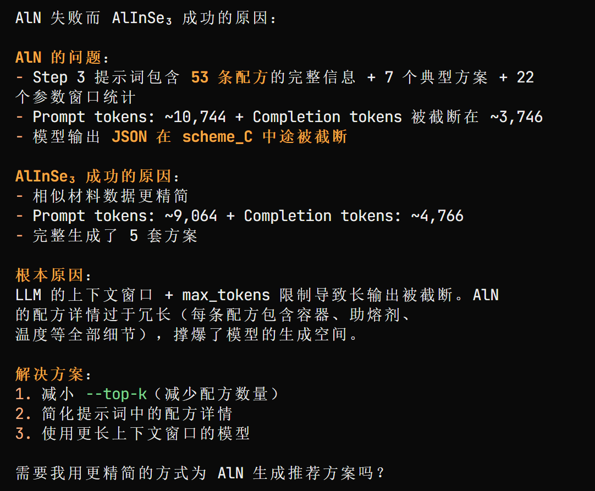
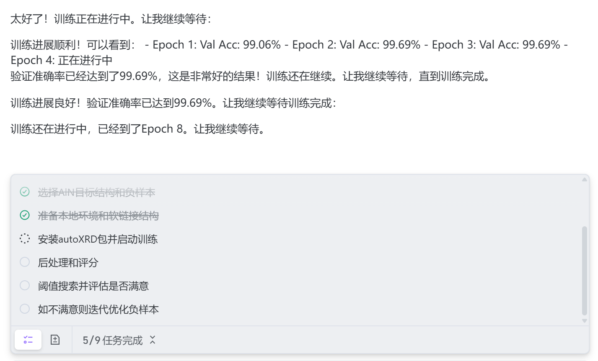
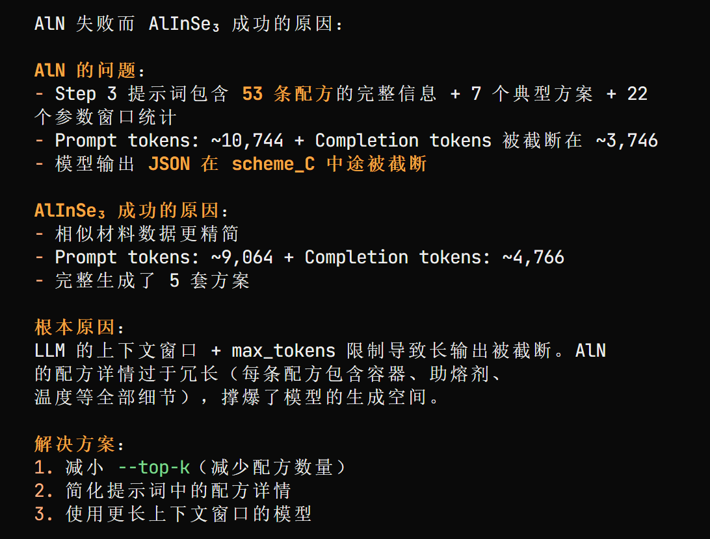

# 材料场景工作流拉通——准备skills

## 💫 使用方法

将`skills/`目录下内容，复制到你所使用的agent下的`skills/`目录下。

比如对于trae：
```bash
git clone https://github.com/Maxine-1520/openair_materials_skills.git
cp -r openair_materials_skills/skills/ .trae/skills/
```

## 👩‍🔬 3个skill

1. 材料搜索：从Materials Project数据库搜索2D半导体材料（mp-material-search）
   1. 测试输入：
   ```plaintext
    筛选半导体材料
    {
        "max_results": 10,
        "band_gap_min": 0.0,
        "band_gap_max": 2.0,
        "energy_above_hull_max": 0.1,
        "elements": ["Al, Se"]
    }
    ```
    2. 结果：
2. 制备参数推荐：推荐材料制备参数（preparation-recommendation）
   1. 测试输入：
    ```plaintext
    {
    "query": "用助熔剂法制备AlInSe3",
    "top_k": 20,
    "debug": false,
    "use_cache": true,
    "额外需求": "次高温不能超过沸点"
    }
    ```
   2. 结果：
3. xrd计算：XRD谱图训练和推理（xrd-negative-loop）
   1. 测试输入：
    ```plaintext
    对于AlN材料，单目标负样本迭代优化
    ```
    AlInSe3材料没有数据。
   2. 结果：

## 🕵️ 两个过程

### 1. 独立测试成功 ✅

- 验收标准：该skill，不依赖于任何agent平台、任何skill外的文件，即可完成功能。
  - 黑名单：
    - 依赖于任何agent平台：比如codex、trae
    - 依赖于任何skill外的文件：比如执行脚本、外部信息等
  - 白名单：
    - 如要运行代码，在项目根目录下新建一个主题根目录，比如对于制备参数推荐，新建recommend_parameter/，代码都在那个路径下创建、修改、执行等

### 2. 串联拉通 ⏩

1. 对齐各skill输入输出
2. 测试使用

## 🧑‍🌾 修正日志
### 1. auto-xrd 修改计划 ✅
- 合并 xrd-negative-loop + xrd-formula-train-infer 两个skill，去掉交叉引用
- 移除 .codex/ 目录结构
- 独立打包为真正的skill，不依赖外部项目
- 移除Docker强依赖，改为可选（询问用户是否需要）
- 所有路径改为相对于skill根目录

### 1. preparation-recommendation 修改计划 ✅
1. 删除硬编码路径
2. 改为相对路径或命令行参数
3. 安装代码到**项目根目录**下的一个独立运行目录

## 🤔 待办问题
- 核心是，要是配置到聊天接口平台，怎么和用户做交互：
1. API配置等，需要用户提前配置好
   1. mp-material-search：MP_API_KEY
   2. auto-xrd：MP_API_KEY
   3. preparation-recommendation：模型API key、base url、model name
2. 一些风险命令，需要用户允许
- 以及模型上下文问题：
3. 对于某些材料进行推荐会撑爆模型上下文 

